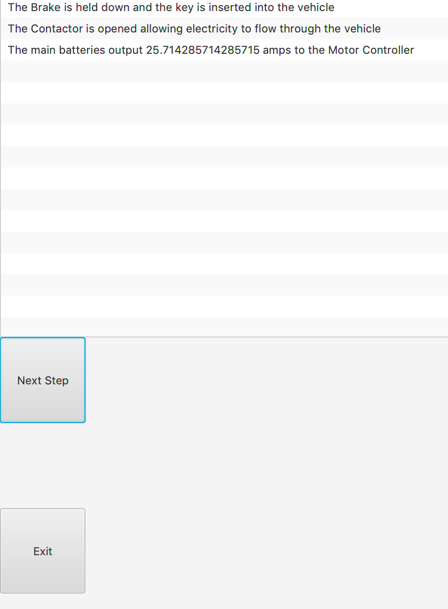
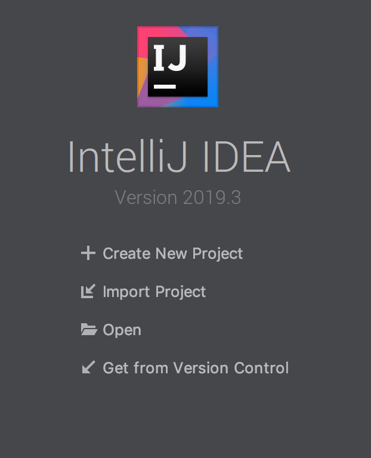

# Java Electric Vehicle Project 

This is a project that was created as a independent study project during January 2019. The goal was to represent a electric vehicle as realistically as possible using Object-Oriented Design principles. This was accomplished by creating a class structure that represents each individual part found in a electric vehicle, and requires parameters specific to the type of vehicle you are trying to model. This was used to create a simulation of a Ford Explorer 2002 so that information like amps used, force in horsepower, and speed in mph can be tracked with a user interface. The details of how the class structure utilizes OOD principles can be found in the Modeling an Electric Vehicle using Java.docx

### Getting Started 

To run this project open IntelliJ and get a project from version control

Then paste the URL for this repository to check out the project. 

Finally to start the program run the Driver.Java class

### Built With 

* IntelliJ - IDE
* JavaFX - Framework for user interface

### Authors 

* Kyle Dennison - KyleDennison
